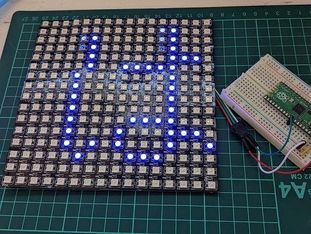

# pico_MicroPython_Multifont 

Raspberry Pi Pico MicroPython用のマルチフォントライブラリ

## 概要

Raspberry Pi Pico MicroPython用の漢字フォントドライバーライブラリです。  
7種類の漢字フォント（8ドットから24ドット)が利用可能です。  
異なるサイズのフォントを逐次切り替えて利用することが出来ます。  
通常のPython環境も動作します(Windows 10/11にて確認)。  

## モジュール名称  

- mfont

## 特徴

- フォントのサイズとして8,10,12,14,16,20,24の7種類をサポートします。
- UTF-8形式の文字の利用が可能です。
- フォントデータはRaspbery Pi picoのフラッシュメモリ上に配置します。
- フォントデータ形式  
  
  ※ 赤い数値はバイトデータの並び順  
- (注意)  
フォントデータには半角カタカナは含まれておりません。  
半角カタカナの文字コードを指定した場合、全角カタカナのフォントデータを返します。

## 利用環境

- Raspberry Pi Pico および互換機 （フラッシュメモリ2Mバイト以上）  
  - 必要ソフト：MicroPython (1.19.1で動作確認)  

- Python 3.x 環境  
  - Windows 10/11  

## サポートするフォントの詳細

半角および、全角日本語ひらがな、カタカタ、漢字、英語アルファベット、ギリシャ文字,記号  
※半角カタカナはサポートしていません。半角カタカナのコードを指定した場合、全角カタカナに置き換えます。  

|フォントサイズ| 利用フォント    |フォント登録数|
|-------------:|-----------------|-------------:|
|8x4           |美咲半角フォント |191           |
|8x8           |美咲フォント     |6879          |
|10x5          |ナガ10 半角      |256           |
|10x10         |ナガ10           |6877          |
|12x6          |東雲半角フォント |256           |
|12x12         |東雲フォント     |6879          |
|14x7          |東雲半角フォント |256           |
|14x14         |東雲フォント     |6879          |
|16x8          |東雲半角フォント |256           |
|16x16         |東雲フォント     |6879          |
|20x10         |Kappa20 半角     |190           |
|20x20         |Kappa20          |6879          |
|24x12         |X11R6半角フォント|221           |
|24x24         |X11R6フォント    |6877          |

※フォントはフラッシュメモリの容量を考慮して、利用するフォントのみフラッシュメモリに配置して下さい。

## 配布ファイル  

````tree
. 
│  README.md [このドキュメント]
│  sample_mfont.py [サンプルプログラム①]
│  sample_mfont_neopixel.py [サンプルプログラム②]
│  sample_oled_mfont.py [サンプルプログラム③]
├─ device  [サンプルプログラム用デバイス制御ライブラリ]
│      neomatrix.py
│      ssd1306.py
├─ etc  [その他]
│  └─ knj10-1.1 [ナガ10 オリジナル配布ファイル ※1]
├─ img [ドキュメント用画像]
└─ mfont [フォントライブラリ]
    │  mfont.py [フォントドライバモジュール]
    │  tma_jp_utl.py [フォントモジュール用サブルーチン]
    │  __init__.py [フォントドライバモジュール用]
    └─ fonts [フォントファイル]
            u_10x10.fnt [ナガ10(10ドット)]
            u_12x12.fnt [東雲フォント(12ドット)]
            u_14x14.fnt [東雲フォント(14ドット)]
            u_16x16.fnt [東雲フォント(16ドット)]
            u_20x20.fnt [Kappa20 (20ドット)]
            u_24x24.fnt [X11R6フォント (24ドット)]
            u_8x8.fnt [美咲フォント(8ドット)]
````

## インストール

- 配布ファイルをダウロードして、利用している開発環境で利用出来るよう、適宜配置してください。  
- Raspberry Pi Pico のフラッシュメモリ上に、ライブラリとフォントデータを配置してください。  
  開発環境 Thonnyのファイルのアップロード機能を利用してmfontディレクトリをこの構成で配置します。  

````install
  mfont [フォントライブラリ]
    │  mfont.py [フォントドライバモジュール]
    │  tma_jp_utl.py [フォントモジュール用サブルーチン]
    │  __init__.py [フォントドライバモジュール用]
    └─ fonts [フォントファイル]
            u_10x10.fnt [ナガ10(10ドット)]
            u_12x12.fnt [東雲フォント(12ドット)]
            u_14x14.fnt [東雲フォント(14ドット)]
            u_16x16.fnt [東雲フォント(16ドット)]
            u_20x20.fnt [Kappa20 (20ドット)]
            u_24x24.fnt [X11R6フォント (24ドット)]
            u_8x8.fnt [美咲フォント(8ドット)]
````

互換機を含め、フラッシュメモリサイズが2Mバイトのデバイスでは、すべてのフォントデータを配置することが、  
出来ませんでの、利用するフォントのみを配置して下さい。  
サンプルプログラムでは、24ドットフォント以外のフォントを配置して利用しています。  

## ライブラリリファレンスマニュアル

### mfontモジュール mfontクラス  

mfontはマルチサイズフォントを操作するためのクラスです。  
モジュール名：mfont  
クラス名：mfont  
インポート宣言： from mfont import mfont

#### コンストラクタ  

【書式】  
class mfont(fs=16, path="./mfont/fonts")  

【引数】  

- sz:ファイルサイズ  
利用するフォントサイズを指定します。  8、10、12、14、16、20、24の指定が可能です。  
省略時は16ドットのフォントを使用します。  

- path:フォントデータ・パス  
フォントデータの配置するパスを指定します。  
フォントデータをデフォルトと異なる位置に配置した場合に指定します。

【説明】  
インスタンスを生成します。  

【利用例】  
from mfont import mfont  
mf=mfont(12)  

#### メソッド  

##### setFontSize(sz)

フォントサイズの指定  

【引数】  

- sz:ファイルサイズ  
利用するフォントサイズを指定します。  
8、10、12、14、16、20、24の指定が可能です。

【戻り値】  
なし  

【説明】  
利用するフォントサイズを指定します。  
begin()にてフォントドライバの利用開始後に、setFontSize()を使用した場合、  
参照しているフォントデータファイルを切り替えます。  

【利用例】  
from mfont import mfont  
mf = mfont()  
mf.setFontSize(12)  

##### begin()

フォントドライバの利用開始  

【引数】  
なし  

【戻り値】  
なし  

【説明】  
フォットドライバの利用を開始します。  
指定したフォントサイズに対応するフォントデータファイルをオープンし、データの参照可能状態にします。  
フォントドライバの利用を終了する場合は、end()を実行して下さい。  

【利用例】  
from mfont import mfont  
mf = mfont()  
mf.setFontSize(12)  
mf.begin()  

##### end()

フォントドライバの利用終了  

【引数】  
なし  

【戻り値】  
なし  

【説明】  
フォットドライバの利用を終了します。  
begin()にてフォントドライバの利用を開始後、利用を終了する場合に使用します。  

【利用例】  
from mfont import mfont  
mf = mfont()  
mf.setFontSize(12)  
mf.begin()  
・・・  
mf.end()  
  
##### getFont(code)

指定した文字コードに対応するフォントデータの取得  

【引数】  

- code : 文字コード（ユニコード）  
取得するフォントデータの文字コードを指定します。  

【戻り値】  
フォントデータ（リスト型）  

【説明】  
引数codeで指定して文字コードに対応するフォントデータを取得します。  

【利用例】  
from mfont import mfont  
mf = mfont()  
mf.setFontSize(12)  
mf.begin()  
font = mf.getFont(ord('あ'))  
print(font)  
mf.end()  

##### getRowLength()

直前に取得したフォントの1行あたりのフォントデータバイト数の取得  

【引数】  
なし  

【戻り値】  
直前に取得したフォントの1行あたりのフォントデータバイト数  

【説明】  
getFont()よる直前に取得したフォントの横1行あたりのバイト数を取得します。  
例えば、全角16ドットのフォットの場合、2を返します。  

【利用例】  
font = mf.getFont(ord('あ'))  
bw = mf.getRowLength()  

##### getWidth()

直前に取得したフォントの横ドット数の取得  

【引数】  
なし  

【戻り値】  
直前に取得したフォントの横ドット数  

【説明】  
getFont()よる直前に取得したフォントの横ドット数を取得します。  
例えば、全角16ドットのフォットの場合、16を返します。  

【利用例】  
font = mf.getFont(ord('あ'))  
w = mf.getWidth()  

##### getHeight()

直前に取得したフォントの縦ドット数の取得  

【引数】  
なし  

【戻り値】  
直前に取得したフォントの縦ドット数  

【説明】  
getFont()よる直前に取得したフォントの縦ドット数を取得します。  
例えば、全角16ドットのフォットの場合、16を返します。  

【利用例】  
font = mf.getFont(ord('あ'))  
h = mf.getHeight()  

##### len()

直前に取得したフォントのデータバイト数の取得  

【引数】  
なし  

【戻り値】  
直前に取得したフォントのデータバイト数の取得  

【説明】  
getFont()よる直前に取得したフォントデータのバイト数を取得します。  
例えば、全角16ドットのフォットの場合、32を返します。  

【利用例】  
font = mf.getFont(ord('あ'))  
bt = mf.len()  

### tma_jp_utlモジュール  

半角・全角コード変換などを行う関数を納めているモジュールです。  

#### モジュールのインポート  

from tma_jp_utl import isHkana, hkana2kana, han2zen

##### isHkana(ucode)

指定した文字が半角カタカナであるかを判定  

【引数】  
ucode：文字コード  

【戻り値】  
True：指定した文字コードが半角カタカナである  
False：  指定した文字コードが半角カタカナでない

【説明】  
指定した文字コードが半角カタカナであるかを判定します。  
半角カタカナの場合はTrueを、そうでない場合はFalseを返します。  

【利用例】  
from tma_jp_utl import isHkana
print(isHkana(ord('ｱ')))  

##### hkana2kana(ucode)

指定した半角カタカナコードに対応する全角カタカナコードを返す

【引数】  
ucode：文字コード  

【戻り値】  
全角カタカナコード（半角カタカナコードでない場合はそのまま返す）

【説明】  
指定した半角カタカナコードに対応する全角カタカナコードを返します。  
指定した文字コードが半角カタカナコードでない場合は、文字コードをそのまま返します。  

【利用例】  
from tma_jp_utl import hkana2kana  
code = hkana2kana(ord('ｱ'))  
print(code)

##### han2zen(ucode)

半角文字コード・全角文字コード変換  

【引数】  
ucode：文字コード  

【戻り値】  
変換コード（ 変換できない場合は元のコードを返す)  

【説明】  
指定した文字コードが半角文字の場合、対応する全角文字コードを返します。  

【利用例】  
from tma_jp_utl import han2zen  
s='1234abcABC'  
for c in s:  
    code = han2zen(ord(c))  
    print(str(c))  

## ライブラリ利用例

### サンプルプログラム①

指定した文字列から文字を１文字ずつ取り出し、標準出力にフォントデータのパターンを表示します。  
Pythonでも動作します（Windows 11で動作確認)。

````sample_mfont.py
# コンソールに漢字を表示するサンプルプログラム
from mfont import mfont

# 定数
MY_FONT_SIZE = 16  # 使用するフォントサイズ

# フォントデータの表示
# font : フォントデータ（リスト）
# w:横ドット数
def fontdump(font, w):
    bn = (w+7)>>3
    for i in range(0, len(font), bn):
        for j in range(bn):
            for k in range(8 if (j+1)*8 <=w else w % 8):
                print("##" if font[i+j] & 0x80>>k else "  ",end="")
        print()
    print()    

s="こんにちは世界！、こんにちは埼玉！"
mf = mfont(MY_FONT_SIZE)
mf.begin()
for c in s:
    code = ord(c)
    font = mf.getFont(code)
    print(hex(code), ":", mf.getWidth(), "x", mf.getHeight())
    fontdump(font, mf.getWidth())
mf.end()
````

実行結果  

````console
>>> %Run -c $EDITOR_CONTENT
0x3053 : 16 x 16
                                
                                
          ######                
                ##########      
                                
                                
                                
                                
                                
      ##                        
      ##                        
      ##                        
        ##                ##    
          ################      
                                
                                

0x3093 : 16 x 16
                ##              
                ##              
              ##                
              ##                
            ##                  
            ##                  
            ##                  
          ##  ####              
          ####    ##            
        ####      ##            
        ##        ##            
      ##          ##          ##
      ##          ##        ##  
    ##              ##    ##    
    ##                ####      
                                                                
(以下略)

````

### サンプルプログラム②

16x16ドットのNeopixcelに文字列をスクロール表示します。  
添付のdeviceディレクトリのneomatrix.pyが必要となります。  
deviceディレクトリとその中のファイルをデバイスのフラッシュメモリに配置して下さい。  
Neopixcel データピンは、互換デバイス Seeed XIAO RP2040を利用とため、26ピンを利用しています。  
用途に応じて適宜変更して下さい。  

````sample_mfont_neopixel.py
# Neopixel 16x16ドットマトリックス マルチフォントライブラリ テスト表示デモ
from micropython import const
from machine import Pin
from time import sleep_ms
from mfont import mfont
from neopixel import NeoPixel
from device.neomatrix import NeoMatrix

# 定数
MY_FONT_SIZE = const(12)       # 使用するフォントサイズ(8,10,12,14,16,20,24)
DIN_PIN      = const(26)       # Neopixcel データピン
MATRIX_W     = const(16)       # Neopixcel 横ドット数
MATRIX_H     = const(16)       # Neopixcel 縦ドット数
FD_COLOR     = const((0,0,20)) # 前景色
BK_COLOR     = const((0,0,0))  # 背景色

# 指定位置のドットの取得
def dotAt(font, lb, x, y):
    return font[lb*y+x//8] & (0x80>>(x%8)) > 0

# 1文字左スクロール挿入
def scrollIn(np, fnt, fc, bc, tm, ypos=0, fw=16, fh=16):
    lb = (fw+7)>>3 # 1行あたりのフォントバイト数
    for x in range(0, fw):
        np.scroll()
        # フォントパターン1列分のセット
        for y in range(0, fh):
            np.pixcel(MATRIX_W-1, ypos+y, fc if dotAt(fnt, lb, x, y) else bc)
        np.update()
        sleep_ms(tm)

# フォントの配置
def putAt(np, font, w, h, x, y,fc, bc, flg=True):
    bn = (w+7)>>3 # 1行あたりのフォントバイト数
    for py in range(h):
        if py+y >= matrix_h:
            break
        for px in range(w):
            if px+x >= matrix_w:
                break
            if dotAt(font, bn, px, py):
               np.pixcel(px, py, fc)
            else:
               if bc != None: # Noneの場合、透明色扱い
                  np.pixcel(px, py, bc)
    if flg:
        np.update()

str="こんにちは世界！、こんにちは埼玉！"  
mf = mfont()
mf.setFontSize(MY_FONT_SIZE)
np = NeoMatrix(DIN_PIN, MATRIX_W, MATRIX_H)
np.cls(True)
mf.begin()

while True:
    for c in str:
        font = mf.getFont(ord(c))
        scrollIn(np, font, FD_COLOR, BK_COLOR, 10, (MATRIX_H-mf.getHeight())//2 ,mf.getWidth(), mf.getHeight())
    sleep_ms(1000)
    np.cls(True)

````

実行結果  
  

### サンプルプログラム③

OLEDディスプレイssd1306(I2C接続)に文字を表示するサンプルプログラムです。  
添付のdeviceディレクトリのssd1306.pyが必要となります。  
deviceディレクトリとその中のファイルをデバイスのフラッシュメモリに配置して下さい。  
I2Cは、互換デバイス Seeed XIAO RP2040を利用とため、6,７ピンを利用しています。  
用途に応じて適宜変更して下さい。  

````sample_oled_mfont.py
# Raspberry Pi Pico MicroPython OLEDディスプレイ フォント表示テストプログラム v2.0
# 利用OLEDディスプレイ: ssd13006 128x64ドット(I2C接続タイプ)

from machine import Pin, I2C
from micropython import const
import time
from device.ssd1306 import SSD1306_I2C
from mfont import mfont

# 定数(デフォルトは、Seeed XIAO RP2040用)
I2C_ID       = const(1)       # I2C ID
I2C_FREQ     = const(400_000) # I2C バス速度
OLED_WIDTH   = const(128)     # OLEDの横ドット数
OLED_HEIGHT  = const(64)      # OLEDの縦ドット数
OLED_ADDR    = const(0x3c)    # OLEDのI2Cアドレス
OLED_SCL     = const(7)       # OLEDのSCLピン
OLED_SDA     = const(6)       # OLEDのSDAピン

# フォントの表示
def drawFont(self, font, x, y, w, h, flg=False):
    bn = (w+7)>>3
    py = y
    for i in range(0, len(font), bn):
        px = x
        for j in range(bn):
            for k in range(8 if (j+1)*8 <=w else w % 8):
                self.pixel(px+k,py, 1 if font[i+j] & 0x80>>k else 0) 
            px+=8
        py+=1
    if flg:
        self.show()

# 改行
def newLine(self):
    self.x=0
    if self.y+self.mf.fs*2 > OLED_HEIGHT:
        self.scroll(0, -self.mf.fs)
        self.fill_rect(0, self.y, OLED_WIDTH, OLED_HEIGHT-self.y, 0)
        self.show()
    else:
        self.y=self.y+self.mf.fs
    
# テキストの表示
def drawText(self, text, x, y, fs, wt=0):
    self.x = x
    self.y = y
    
    # フォントの設定
    self.mf = mfont(fs)
    self.mf.begin()

    # テキスト表示
    for c in text:
        if c == '\n': # 改行コードの処理
            self.newLine()
            continue
        code = ord(c) 
        font = self.mf.getFont(code)
        if self.x+self.mf.getWidth()>=OLED_WIDTH:
            self.newLine()
        self.drawFont(font, self.x, self.y, self.mf.getWidth(), self.mf.getHeight(), True)
        if wt:
            time.sleep_ms(wt)
        self.x+=self.mf.getWidth()
    self.mf.end()

# SSD1306_I2Cに漢字表示インスタンス・メソッドの追加
SSD1306_I2C.drawText = drawText
SSD1306_I2C.drawFont = drawFont
SSD1306_I2C.newLine  = newLine

# OLEDディスプレイのインスタンスの生成
i2c = I2C(I2C_ID, scl=Pin(OLED_SCL), sda=Pin(OLED_SDA), freq=I2C_FREQ)
oled = SSD1306_I2C(OLED_WIDTH, OLED_HEIGHT, i2c, addr=OLED_ADDR)
oled.contrast(255)
oled.invert(False)

# 表示用テキスト
txt = "吾輩は猫である。名前はまだ無い。"\
    "どこで生れたかとんと見当がつかぬ。"\
    "何でも薄暗いじめじめした所でﾆｬｰﾆｬｰ泣いていた事だけは記憶している。"

# テキストの表示
while True:
    for fsize in (20,16,14,12,10,8):
        oled.fill(0)
        oled.text(str(fsize)+"px font",0,0,1)
        oled.show()
        time.sleep(2)
        oled.fill(0)
        oled.drawText(txt, 0, 0, fsize, 50)
        time.sleep(2)

````

実行結果  
  

## ライセンス・使用条件

フォントライブラリのプログラム部に関しては製作者本人に帰属しますが、自由に利用下さい。
フォントデータに関しては、著作権はフォントの各製作者に帰属します。

 ・ 8ドットフォント  
    美咲フォント [フリー（自由な）ソフトウエア]  
    http://www.geocities.jp/littlimi/misaki.htm  
    ライセンスに関する記載 http://www.geocities.jp/littlimi/font.htm#license  

 ・ 10ドットフォント  
    ナガ10(1.1):[独自ライセンス]  
    http://hp.vector.co.jp/authors/VA013391/fonts/#naga10  
    ライセンスに関する記載 \knj10-1.1\README  

 ・12/14/16ドットフォント  
    東雲フォント(0.9.6):[public domain]  
    http://openlab.ring.gr.jp/efont/shinonome/index.html.ja  
    ライセンスに関する記載 同HP  

 ・20ドットフォント  
    Kappa 20dot fonts(0.3):[public domain]  
   http://kappa.allnet.ne.jp/20dot.fonts/(リンク切れ)  

 ・24ドットフォント  
  X11R6同梱のフォント:[(通称)X11ライセンス]  
   http://www.x.org  

本ライブラリおよび配布するファイルは上記フォントの二次加工ファイルを含むのため、  
ライセンスについはては  使用フォントのライセンスに従うものとします。  

使用しているナガ10について商用利用に関する制約記載があるため  
本配布ファイルも個人および非営利目的での利用のみとします。  

またナガ10フォントの配布条件に従い、オリジナルのフォントとドキュメントを添付します(※1)。  

再配布については、本構成のままであれば自由とします。  
フォントファイルのみの配布は禁止します。  
